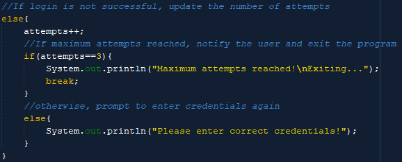
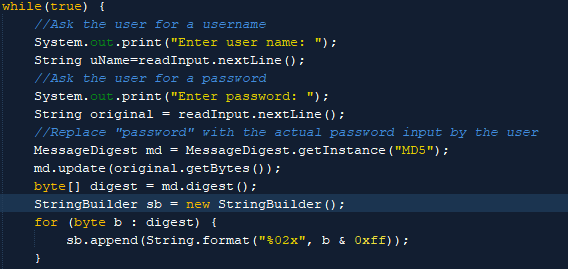
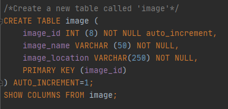
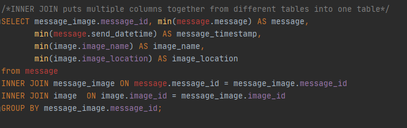
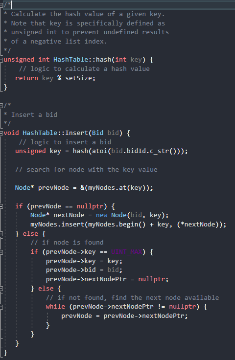
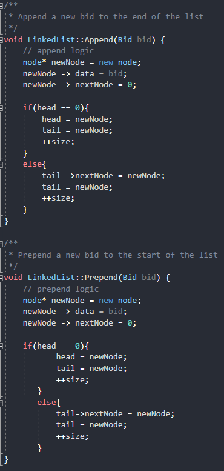
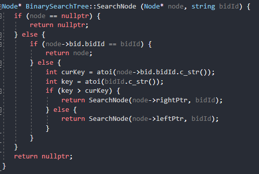
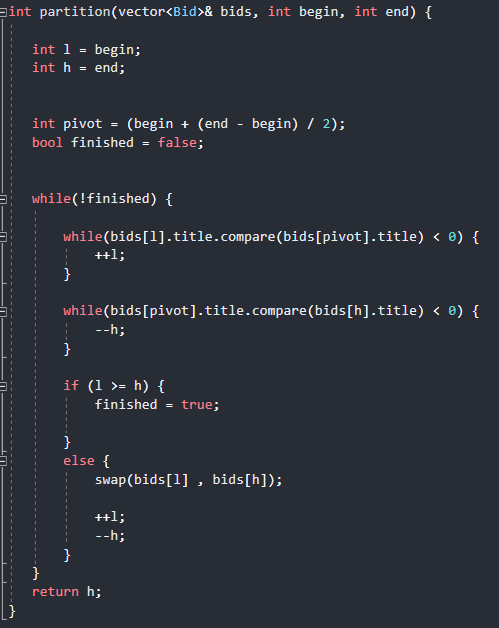

# Professional Self Assessment

  Throughout the journey to recieve a BS in Computer Science, I have learned a lot of skills and in turn have focused on what my path in the field of computer science should be. In this ePortfolio you will see examples of my ability to create and use multiple algorithms and data structures, create software with security measures to protect sensitive data, and build and manipulate databases as well as writing custom SQL queries to show detailed tables from larger datasets. During my time in the CS program I also learned how to work in a team environment by utilizing github to collaborate with classmates on projects, and the basics of working in an agile work environment. 

# Code Review

<iframe width="720" height="650" src="https://www.youtube.com/embed/kHSvA8kQFaU" frameborder="0" allow="accelerometer; autoplay; clipboard-write; encrypted-media; gyroscope; picture-in-picture" allowfullscreen></iframe>

# Artifacts

In this ePortfolio there are three artifacts I feel best showcase some of the skills I learned throughout the course of obtaining my Bachelor's degree at SNHU. These artifacts display a solid foundation in database management, use and construction of data sets and algorithms, and software development with a security mindset.

### Authentication System ( Java )
[Source code here](https://github.com/brownt92/brownt92.github.io/tree/main/AuthenticationSystem)

This is an Authentication System written in Java. It asks the user in the command line for a usernasme and password, encrypts the password, then verifies the encrypted string and username are present in a mock database comtaining all employee login information.


The program only allows three failed attempts at login before locking the user out.



Here is a look at the code to encrypt the given password.

### Database Script ( SQL )
[Source code here](https://github.com/brownt92/brownt92.github.io/tree/main/Database%20Management)

This artifact is an SQL script used to simulate a phone companmy database that stores customers info and messages and query and build tables to better visualize the data.



Script to create a new table in the company's database.



Query script to create a new table usinmg values from other tables in the database.

### Data Structures and Algorithms ( C++ )
[Source code here](https://github.com/brownt92/brownt92.github.io/tree/main/Data%20Structures%20and%20Algorithms)

This project is a set of programs written in C++ that use various forms algorithms and data structures to sort, add, remove, and search a dataset containing bid information from a betting site. 

Each algorithm requires a specific data structure to work properly. For example, a search tree data structure would look like this:

```
struct Node {
   Bid bid;
   Node* parentPtr;
   Node* leftPtr;
   Node* rightPtr;
};
```
while a data structure for a linked list would look like this:
```
struct Node {
   Bid data;
   Node* nextNode;
};

Node* head;
Node* tail;
int size;
```
Insert algorithm to insert bids into a hashtable



Algorithm for adding bids to the front or back of a linked list



Algorithm for searching for a node value in a binary search tree



Algorithm that uses partitioning to sort bids by value to order the bids by value




